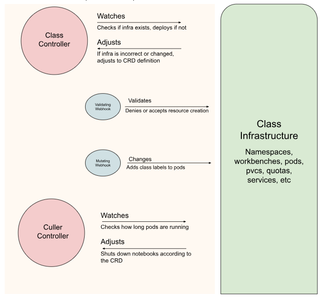

# class-operator

The class operator is a Kubernetes operator that will deploy the infrastructure necessary to run classes in a cloud environment, as a way to maintain the Open Education Project (OPE) for future use.

This operator will allow for class infrastructure to be easily deployed and managed through a declarative interface, enabling administrators to define class environments, user access, and resource policies in a scalable and reproducible way.

## How to install the operator

  1. Login to Quay.io

  docker login quay.io -u <your-username>

  2. Generate CRDs and Test

  ### Generate/update CRD manifests
  `make manifests`

  ### Run tests
  `make test`

  3. Build and Push the Image

  ### Build the image
  `make docker-build`

  ### Push to quay.io
  `make docker-push`

 4. Deploy Operator
  
  `make deploy`

 5. Install CRD
  
  `make install`